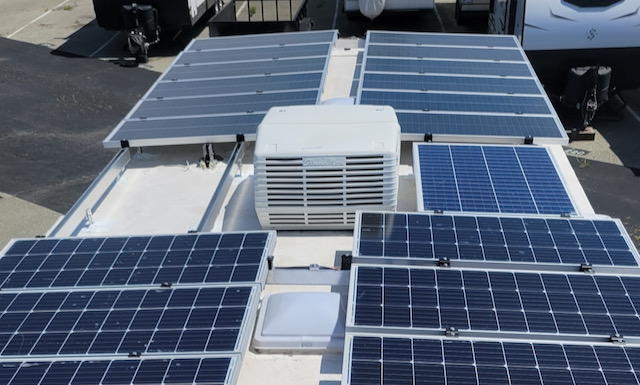

# How to calculate Air Conditioning power needs from outside temperature!

A common question among RVers when they start installing solar and lithium batteries is, “how much will I need to run my air conditioner?” Like many questions, the answer is it depends. To figure this out, we need to know several pieces of information. For a given outdoor temperature, how much energy is needed to maintain the thermostat temperature? Calculating by adding up all of the sources of heat, insulation, and equipment specification while possible, it is much easier to run an experiment. 

You will need an internal temperature sensor, an external temperature sensor, and a power meter. I used Ecowitt for my outdoor temperature sensor, I decoded the bluetooth on my Easytouch RV thermostat to get the internal temperature, and my Growatt inverter reports how much energy I am using throughout the day. My AC is a Coleman high efficiency model which uses around 1000W when on.

The next concept is degree-hour. This is a way of quantifying how much energy the AC will need to remove from the space based on the difference between the indoor and outdoor temperature. This bit of mathematical wizardry allows us to exclude the temperatures which the AC would not need to deal with. In looking at the graphs, my unmodified outdoor temperature is roughly 5 degrees less than the measured indoor temperature. Take the target thermostat temperature, subtract 5 minus the measured the average outdoor temperature for the hour, then sum all of the positive numbers.

 
For a given day we calculate the total number of degree-hours and measure the total number of Watt-hours of energy used to maintain it. My test setup included no other appliances on, the space unoccupied, doors and windows closed, measurement period from midnight to midnight.

| Date       | degree-hours | target Temp | Watt-hours|
|------------|--------------|-------------|-----------|
| 2024-03-14 | 12.69        | 75          | 577.6     |
| 2024-03-16 | 47.27        | 75          | 2174.6    |
| 2024-03-17 | 27.06        | 75          | 1475.8    |

Now we have some data that we can make predictions from. If we calculate the slope and intercept using gsheets we get the formula  Wh * 0.0217 - 2.6=Fh, or the reverse Fh * 43.91 + 178.6 = Wh for a given temperature day. Now that we have a formula, we can calculate the power needs over a range of temperatures. So for an 80F degree day (60Fh degree hours), keeping the target temp at 75 will take 2.3kWh for the day to maintain. Now for a really hot day high of 100F (400Fh degree hours), we might need 18kWh over 24h to maintain 75F. During certain parts of the day the AC is not going to be able to keep up and is running 18 out 24 hours.

We can also work the reverse. Le’ts say we have 10kWh of battery we want to spend on keeping us cool, what temperature should we set the thermostat to on that 100F day to ensure we don't run out of power? Utilizing the formula we find a target temperature of 83F will need to remove 214Fh degree-hours worth of energy which works out to about 10kWh. What if we wanted to make it dynamic based upon how much power our panels are producing and the current measured outdoor temperature? Let's say we are getting 800 Watts for the next hour on our panels, what temp would we need to set the thermostat to exactly use 800Wh?  800Wh * 0.0217 - 2.6 = 15Fh. If the outside is 100F, add 5F, subtract 15F, gives us a target of 90F. With the AC running 100% of the time, the best it can do is remove about 20 degrees worth of energy, for a temp target of 85F (100+5-20).  

Now that I know how much power I need for a given outdoor temperature and how much power I have available, I can create a power budget for every state of charge (SOC) level and power input. I’m assuming I want to dedicate 70% to comfort and the remaining to other critical load. An 80% SOC leaves 10kWh for the AC, or 437W an hour for the next 24 hours, or 7 degree-hours. This means I can set the thermostat to 2 degrees below the current outdoor temperature. With the addition of solar, we want to know how much should go to maintaining comfort and how much to recharge the batteries. With 600 Watts solar added to the comfort column we can now be 15 degrees below the outdoor temp. Luckily, high levels of solar are correlated to high outdoor temperature. 

With a remotely controlled thermostat such as the EasyTouch, we can measure the outdoor temperature, calculate how much power we have, and have the server automatically set the temperature over bluetooth within the guardrails of 75F-90F. 

Now I can answer the question I started with, "How much solar/battery do I need to run one AC on a 90F day to maintain 75F inside?" About 5kWh of battery and to recharge that battery, I'll need 1.0kW-1.6kW of solar (using a solar factor of 3-5).

Notes: 
Remember these calculations are based upon my personal setup and do not take into account confounding variables; such as opening and closing doors, heat from other appliances, body heat, radiant vs conduction  heat, running two ACs at different temperatures, outdoor-indoor lagging temperatures, cloudy days, etc. 

I am using Fahrenheit(F) for temperature, Fh for degree-hours, Watts(W) for power and Watt-hours(Wh) for energy. k is the prefix for one-thousand 1kWh=1000Wh. To convert from Ah(amp-hour) to Wh multiply by the nominal battery voltage. V*Ah=Wh. Numbers are rounded for clarity and the slope and intercept are based upon a larger dataset.
